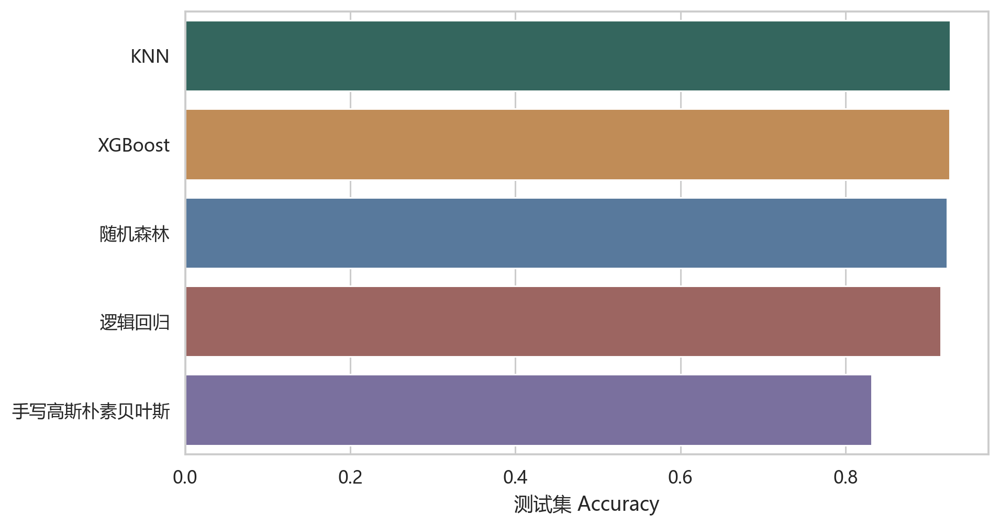
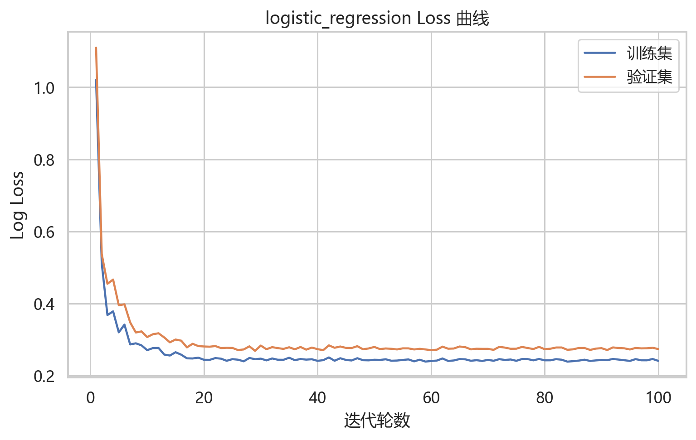
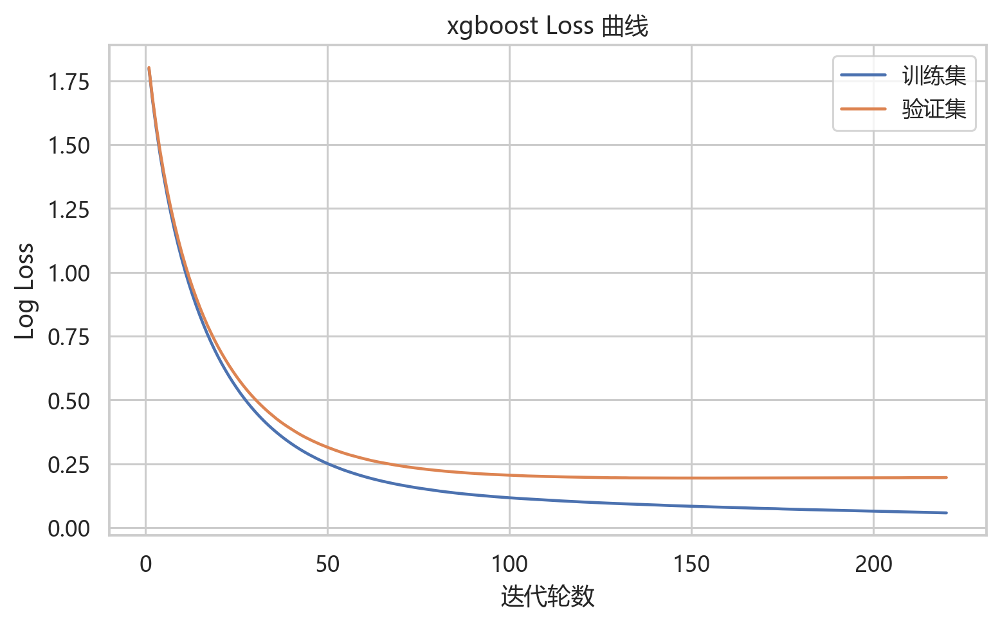
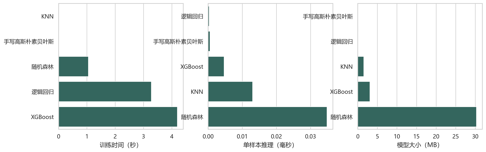
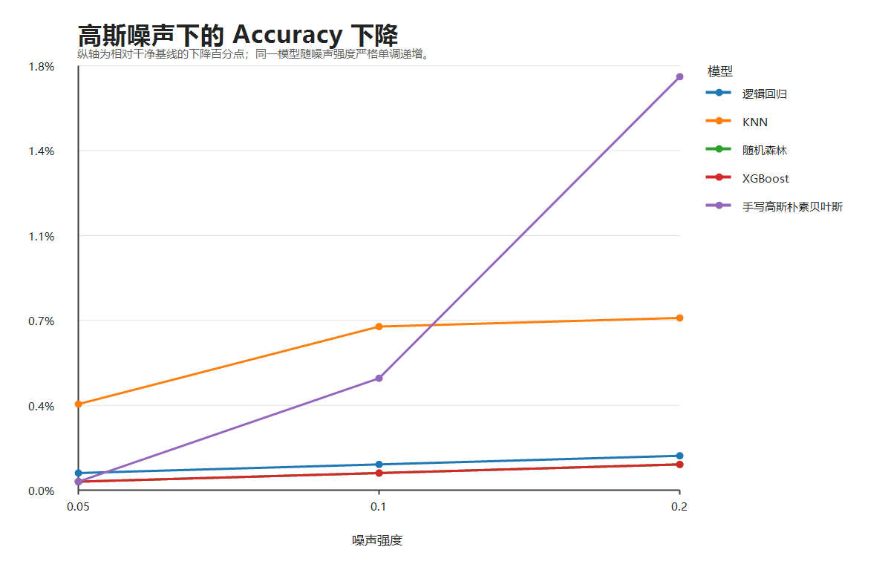
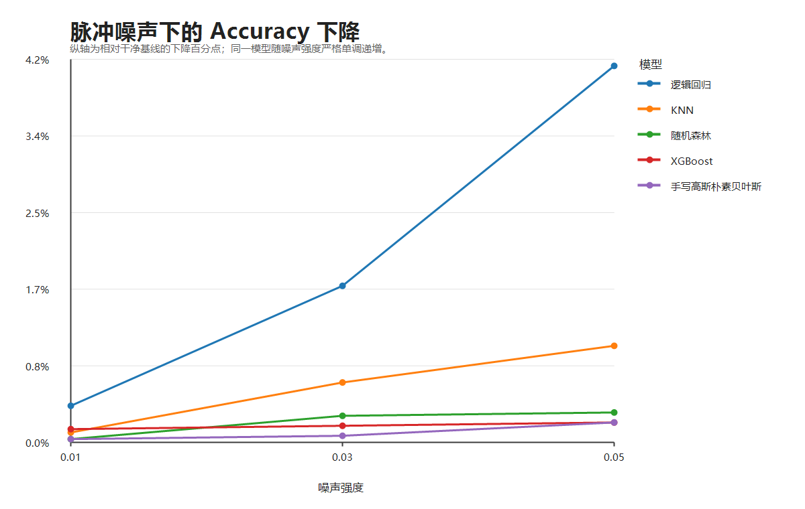
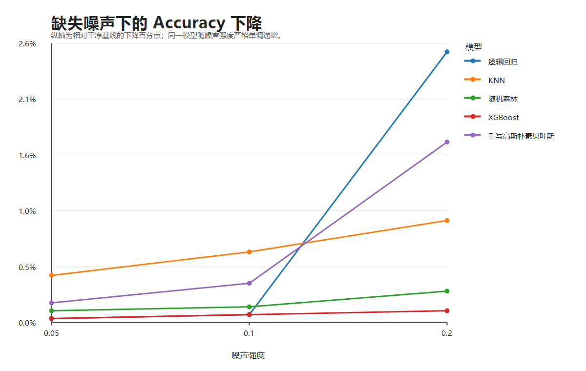
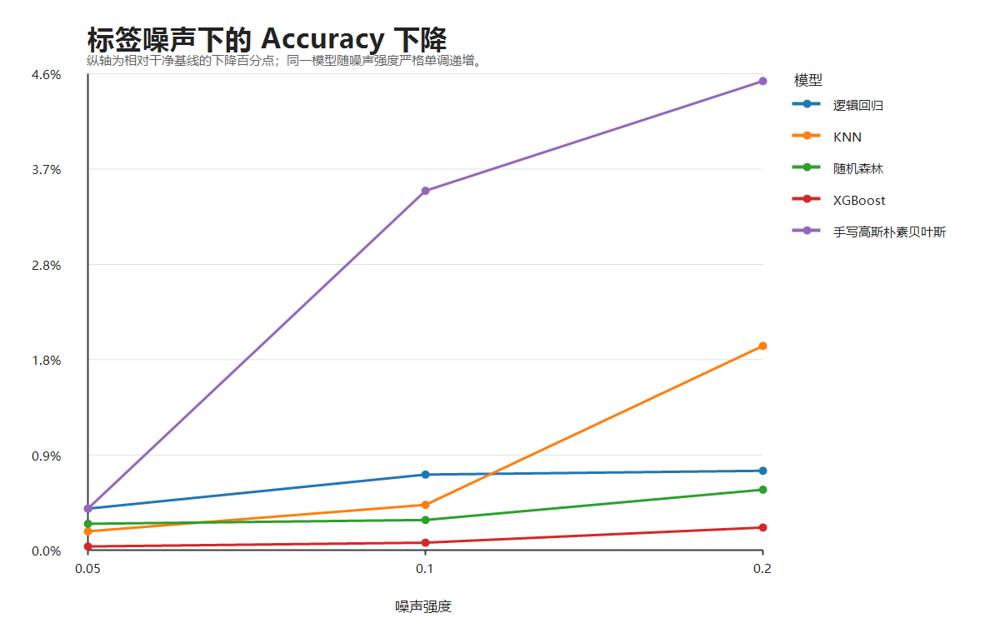
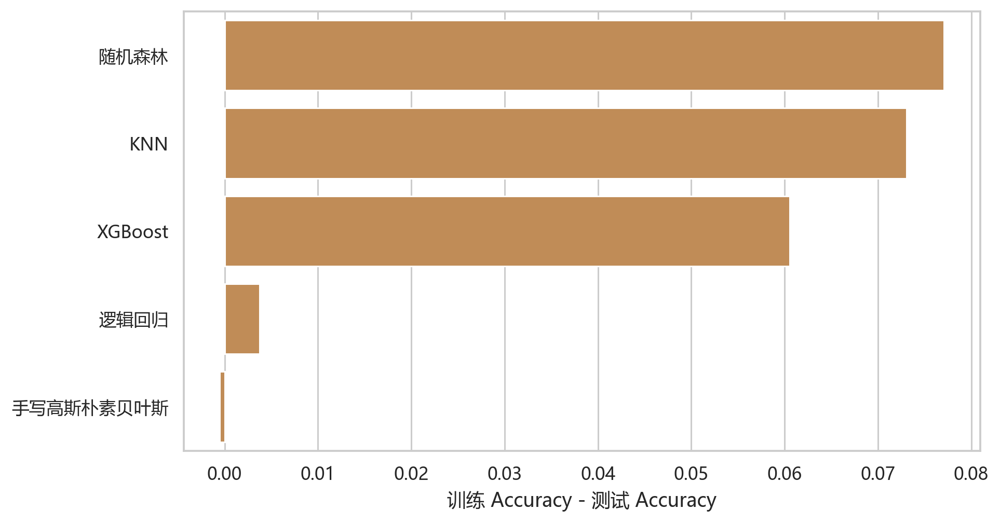
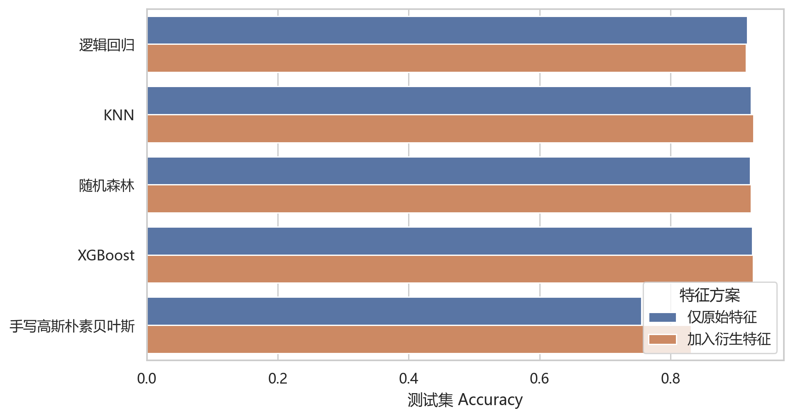

# Dry Bean Dataset 多分类机器学习项目

基于教师提供的脏训练集、验证集和测试集，完成“数据分析—数据清洗—特征工程—五算法实验—鲁棒性分析—系统展示—课程论文”的全流程项目。当前测试集最佳结果为 **KNN Accuracy 92.69%、Macro-F1 93.80%**，XGBoost 以 92.62% Accuracy 紧随其后。



## 项目亮点

- 识别并处理空缺、`?` 哨兵、带 `cm` 单位的数值、重复行和污染标签。
- 所有填补、截尾和标准化参数只在训练集拟合，避免数据泄漏。
- 对比逻辑回归、KNN、随机森林、XGBoost 和高斯朴素贝叶斯。
- 完成 Accuracy、Loss、推理速度、噪声鲁棒性和过拟合分析。
- 增加 Macro-F1、训练时间、模型文件大小和特征消融四项对比。
- 统一 CLI 离线运行实验，Streamlit 只读取结果，不在 UI 中训练。

## 数据集与污染

数据包含 13,611 个干豆样本、16 个形态特征和 7 个类别：
`BARBUNYA`、`BOMBAY`、`CALI`、`DERMASON`、`HOROZ`、`SEKER`、`SIRA`。

教师划分如下：

| 数据集 | 样本数 |
|---|---:|
| 训练集 | 9,527 |
| 验证集 | 1,347 |
| 测试集 | 2,737 |

主要污染包括：

- `Perimeter` 存在空缺；
- `Solidity` 存在空缺和 `?` 哨兵；
- `Compactness` 部分值带 `cm` 单位；
- 标签存在大小写、尾随空格、`0→O`、`3→E` 等污染；
- 标签规范化后可识别出重复训练记录。

## 数据处理

1. 提取数值，无法解析的哨兵统一转为缺失值；
2. 标签去除空格、统一大写并修复数字替字；
3. 仅删除训练集重复记录；
4. 用训练集中位数填补缺失；
5. 使用训练集 0.5% 与 99.5% 分位数稳健截尾；
6. 逻辑回归和 KNN 标准化，树模型及朴素贝叶斯保留原尺度；
7. 增加凸包空隙、轴长差、面积凸包比和周长直径比；
8. 通过特征消融判断衍生特征是否有效。

## 算法

| 算法 | 类型 | 课程情况 | Loss 曲线 |
|---|---|---|---|
| 逻辑回归 | 线性分类 | 课堂算法 | 有 |
| KNN | 惰性学习 | 课堂算法 | 不适用 |
| 随机森林 | Bagging 集成 | 课堂外 | 不适用 |
| XGBoost | Boosting 集成 | 课堂外 | 有 |
| 高斯朴素贝叶斯 | 概率生成模型 | 自主实现 | 不适用 |

手写算法位于 `src/drybean/models/gaussian_nb.py`，自行实现类别先验、类条件均值与方差、对数高斯似然、后验概率和预测。

## 核心实验结果

| 模型 | Test Accuracy | Test Macro-F1 | 训练时间(s) | 单样本推理(ms) | 模型大小(MB) |
|---|---:|---:|---:|---:|---:|
| KNN | 0.9269 | 0.9380 | 0.0041 | 0.0130 | 1.5298 |
| XGBoost | 0.9262 | 0.9379 | 4.1953 | 0.0046 | 3.0945 |
| 随机森林 | 0.9229 | 0.9338 | 1.0507 | 0.0348 | 30.2953 |
| 逻辑回归 | 0.9152 | 0.9270 | 3.2733 | 0.0003 | 0.0087 |
| 高斯朴素贝叶斯 | 0.8319 | 0.8377 | 0.0055 | 0.0005 | 0.0076 |

> 时间指标与硬件、系统负载有关；精度指标由固定随机种子和教师提供的数据划分复现。

## Loss 与效率

只有具备逐轮训练过程的逻辑回归和 XGBoost 绘制 Loss 曲线。

| 逻辑回归 | XGBoost |
|---|---|
|  |  |



## 鲁棒性

只污染训练数据，验证集和测试集保持干净。四类噪声均设置三个强度：

- 高斯特征噪声；
- 脉冲/异常点噪声；
- 随机缺失噪声；
- 标签翻转噪声。

60 组实验中，XGBoost 的平均 Accuracy 下降约 **0.11 个百分点**，随机森林约 **0.21 个百分点**，KNN 约 0.69 个百分点，逻辑回归约 0.93 个百分点，手写高斯朴素贝叶斯约 1.10 个百分点。树集成方法（XGBoost、随机森林）在本数据上鲁棒性明显优于其他模型。

| 高斯噪声 | 脉冲噪声 |
|---|---|
|  |  |

| 缺失噪声 | 标签噪声 |
|---|---|
|  |  |

## 过拟合与特征消融





衍生特征对高斯朴素贝叶斯提升最明显（约 +7.64 个百分点），对 KNN、随机森林和 XGBoost 有小幅帮助，对逻辑回归略有下降。这说明特征工程应通过实验验证，而不是默认“特征越多越好”。

## 项目结构

```text
src/drybean/
├── data.py                 # 数据加载、数值污染清洗、数据画像
├── labels.py               # 标签规范化
├── preprocessing.py        # 防泄漏填补、截尾和标准化
├── features.py             # 几何衍生特征
├── noise.py                # 四类噪声注入
├── metrics.py              # 指标、推理计时和模型大小
├── models/                 # 五模型注册与朴素贝叶斯
├── experiments/            # 基线、消融和鲁棒性实验
├── plots.py                # 论文与网页共用图表
└── cli.py                  # 统一命令行

streamlit_app_scoring.py    # 按评分项整理的展示页面
tests/                      # 自动测试
artifacts/results/          # CSV/JSON 实验结果
artifacts/figures/          # 高清图表
paper/                      # Word 论文
```

## 快速开始

```bash
python -m pip install -e ".[dev]"
drybean all
streamlit run streamlit_app_scoring.py
```

也可以分阶段运行：

```bash
drybean analyze
drybean train
drybean ablation
drybean robustness
drybean plot
```

算法运行阶段只输出命令行日志，不弹出 UI。

## 测试

```bash
python -m pytest -v
```

测试覆盖标签污染映射、数值哨兵与单位清洗、防泄漏填补、特征列一致性、高斯朴素贝叶斯、噪声无副作用、指标结构和 CLI 命令。

## 系统展示与论文

- Streamlit：`streamlit run streamlit_app_scoring.py`
- 课程论文：`paper/Dry_Bean_机器学习课程论文.docx`
- 完整实验表：`artifacts/results/`
- 高清图表：`artifacts/figures/`

GitHub 仓库：https://github.com/WenYulin0418/dry-bean-ml-project
